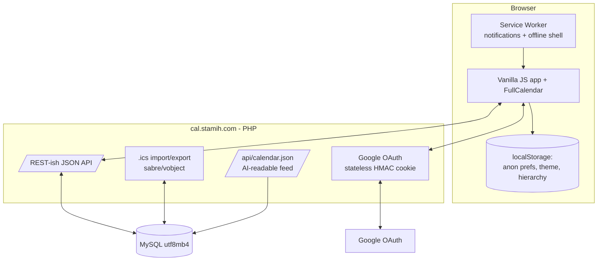

# Nexus Calendar — System Design

A multi-calendar web app at **cal.stamih.com**. Anonymous visitors browse curated
public calendars (Finance, World Cup, etc.); Google-authenticated users add and manage
their own private calendars. Optimized for desktop and mobile, with import/export,
notifications, theming, and a stable machine-readable feed for AI agents.

Design principle: **minimal but sufficient.** Plain PHP + MySQL backend, vanilla-JS
frontend, no build step — everything deploys as-is through the existing FTP/Actions
pipeline.

---

## 1. Constraints (from the hosting environment)

- GoDaddy/cPanel shared hosting: PHP + MySQL, **no SSH**, no long-running processes, no cron guarantees.
- Deploy is push-to-`main` → GitHub Actions → FTP (see `stamih-infra.md`).
- PHP sessions are unreliable → **stateless HMAC auth** (same pattern as Dash).
- `config.php` holds secrets, lives only on the server, never committed.

These rule out background workers and server push, which is why notifications are
client-side and public-calendar content is curated rather than auto-ingested.

---

## 2. Architecture overview



Three planes:

1. **Read plane** (public, unauthenticated): list public calendars, fetch expanded
   events for a date window, export `.ics`, read `/api/calendar.json`.
2. **Write plane** (authenticated): create/import calendars, CRUD events, save prefs.
   Public calendars are writable only by an **admin email allowlist** (you).
3. **Client state plane**: anonymous users keep enabled-calendars, hierarchy, and theme
   in `localStorage`; logged-in users get the same persisted server-side.

---

## 3. Tech stack

| Layer | Choice | Why |
|---|---|---|
| Backend | PHP (PDO/MySQL) | Native to the host; mirrors Dash |
| DB | MySQL, `utf8mb4` | Per infra rule (4-byte safe) |
| Auth | Google OAuth, stateless HMAC cookie | Sessions unreliable on shared hosting |
| Calendar engine | [FullCalendar](https://fullcalendar.io/) (MIT), vendored | Month/week/day views, drag-drop, event ordering out of the box; no build step |
| iCalendar | [sabre/vobject](https://sabre.io/vobject/) (PHP) | Battle-tested RFC 5545 parse/generate + recurrence expansion |
| Frontend | Vanilla JS + CSS variables | No framework, no bundler — deploys raw over FTP |
| PWA | Web App Manifest + Service Worker | Installable; client-side notifications |

`sabre/vobject` is the one Composer dependency. CI runs `composer install --no-dev`
and the resulting `vendor/` is uploaded by the FTP step — the frontend stays build-free.

---

## 4. Data model

```
users
  id              BIGINT PK
  google_sub      VARCHAR  UNIQUE      -- stable Google user id
  email           VARCHAR
  display_name    VARCHAR
  created_at      DATETIME

calendars
  id              BIGINT PK
  owner_user_id   BIGINT NULL          -- NULL => public/admin-managed
  slug            VARCHAR UNIQUE       -- used in URLs and .ics feeds
  name            VARCHAR
  description     TEXT
  color           VARCHAR(9)           -- hex
  icon            VARCHAR              -- short name/emoji
  visibility      ENUM('public','private')
  default_priority INT                 -- base hierarchy rank
  feed_token      VARCHAR NULL         -- for subscribing to private .ics
  timezone        VARCHAR
  created_at, updated_at DATETIME

events
  id              BIGINT PK
  calendar_id     BIGINT FK
  uid             VARCHAR UNIQUE       -- iCal UID (stable across import/export)
  title           VARCHAR
  description     TEXT
  location        VARCHAR
  starts_at       DATETIME             -- stored UTC
  ends_at         DATETIME
  all_day         TINYINT
  timezone        VARCHAR              -- original tz for display
  rrule           TEXT NULL            -- RFC 5545 RRULE for recurrence
  exdates         TEXT NULL            -- excluded occurrences
  created_at, updated_at DATETIME

user_calendar_prefs                    -- per-user view of any calendar
  user_id         BIGINT FK
  calendar_id     BIGINT FK
  enabled         TINYINT
  color_override  VARCHAR(9) NULL
  priority_override INT NULL
  PRIMARY KEY (user_id, calendar_id)

calendar_shares                        -- share a private calendar with others
  id               BIGINT PK
  calendar_id      BIGINT FK
  shared_with_email VARCHAR             -- invited by email (may pre-date their first login)
  shared_with_user_id BIGINT NULL FK    -- resolved to a user on their login
  role             ENUM('viewer','editor')
  created_by       BIGINT FK            -- the owner who shared it
  created_at       DATETIME
  UNIQUE (calendar_id, shared_with_email)
```

All tables `DEFAULT CHARSET=utf8mb4 COLLATE=utf8mb4_unicode_ci`; PDO DSN uses
`;charset=utf8mb4` (per infra lesson).

**Anonymous users** have no `user_calendar_prefs` rows — the same shape (enabled set,
color/priority overrides, theme) lives in `localStorage` and is applied client-side.

---

## 5. Auth & authorization

- **Login** reuses the Dash flow: `/auth/login.php` → Google → `/auth/callback.php`
  sets the HMAC cookie (`cal_auth`) → `/auth/logout.php` clears it. CSRF state =
  `timestamp.nonce.HMAC(...)`, 10-min expiry.
- **Admin** = email in a `config.php` allowlist. Admins can create/edit **public**
  calendars and their events.
- **Authorization rules**
  - Public calendars: world-readable; writable only by admin.
  - Private calendars: readable/writable by `owner_user_id`, plus anyone in
    `calendar_shares` for that calendar — `viewer` = read-only, `editor` = can CRUD events.
  - Sharing is invited by email; the share resolves to a `user_id` when that person
    next logs in (email matched against their Google account). Only the owner can
    add/remove shares or change a calendar's settings; shared users can't re-share.
  - `.ics` of a private calendar: reachable via its unguessable `feed_token` (so
    external apps can subscribe), otherwise auth required.

---

## 6. API surface

JSON over HTTPS. Reads are public where the data is public; writes require the cookie.

```
GET    /api/calendars                 list public (+ user's private if logged in) + prefs
GET    /api/events?cals=a,b&from&to   expanded occurrences in [from,to) as JSON
POST   /api/calendars                 create (private; admin may create public)
PATCH  /api/calendars/:id             rename, recolor, reprioritize, enable
DELETE /api/calendars/:id
POST   /api/events                    create (one-time or with rrule)
PATCH  /api/events/:id                edit; drag-drop sends new starts_at/ends_at
DELETE /api/events/:id
POST   /api/import                    upload .ics into a calendar
GET    /cal/:slug.ics                 iCal export feed (token for private)
GET    /api/calendar.json             documented AI-readable feed (see §11)
POST   /api/prefs                     persist enabled/hierarchy/theme (logged-in)
GET    /api/calendars/:id/shares      list shares (owner only)
POST   /api/calendars/:id/shares      add a share {email, role} (owner only)
DELETE /api/calendars/:id/shares/:sid remove a share (owner only)
```

Server-side recurrence: the API expands `rrule` into concrete occurrences for the
requested window using sabre/vobject, so the frontend and AI both receive plain events
and recurrence logic lives in exactly one place.

---

## 7. Time & recurrence

- Store `starts_at`/`ends_at` in **UTC**; keep the original `timezone` for display.
- All-day events stored as dates, rendered tz-independently.
- Recurrence as RFC 5545 `RRULE` (+ `EXDATE` for exceptions). Expansion happens
  server-side per query window — never store every occurrence.
- A recurring event is flagged in API output so the UI can show a small "↻" icon.

---

## 8. Calendar hierarchy & day overflow

- Effective priority = `priority_override ?? default_priority`.
- In a day cell, events sort by `(priority, starts_at)`. When a cell overflows, show
  the top N then a **"+k more"** control (Outlook/Google pattern) that opens the day
  view or a popover with the full, ordered list.
- Users reorder calendars (drag the calendar list) to change hierarchy; saved to
  `localStorage` (anon) or `user_calendar_prefs` (logged-in).

---

## 9. Frontend architecture

```
index.html            app shell
assets/app.js         state, data fetching, view wiring, modals, drag-drop -> PATCH
assets/app.css        layout + theme tokens (CSS custom properties)
assets/vendor/        FullCalendar (vendored, no CDN dependency)
sw.js                 service worker (offline shell + notifications)
manifest.webmanifest  PWA install metadata
```

- **Views**: month / week / day / agenda (FullCalendar), responsive — month on
  desktop, agenda/day-first on mobile.
- **Interactions**: click empty slot to create, click event to edit in place,
  drag/resize to reschedule (optimistic update → `PATCH`, rollback on error).
- **State**: a single client store hydrated from `/api/calendars`; anon overrides
  layered from `localStorage`.

---

## 10. Theming

CSS custom properties define every color. A handful of preset **themes**, each with a
**light and dark** variant; the active theme + mode is stored in `localStorage` (and
server prefs when logged in). No per-theme stylesheets — just swapped variable sets.

---

## 11. Import / export & AI-readable format

- **Export**: `GET /cal/:slug.ics` — standard iCalendar, importable by Google/Outlook/Apple.
- **Import**: `POST /api/import` accepts an `.ics` upload (admin → public cal, user → private cal).
- **AI feed**: `GET /api/calendar.json?cals=...&from=...&to=...` — a stable, documented
  shape any agent can consume:

```json
{
  "generated_at": "2026-06-14T12:00:00Z",
  "range": { "from": "2026-06-01", "to": "2026-07-01" },
  "calendars": [
    { "slug": "finance", "name": "Finance", "visibility": "public", "color": "#38bdf8" }
  ],
  "events": [
    {
      "calendar": "finance",
      "title": "FOMC rate decision",
      "start": "2026-06-17T18:00:00Z",
      "end": "2026-06-17T18:30:00Z",
      "all_day": false,
      "recurring": false,
      "location": null,
      "description": null
    }
  ]
}
```

Same underlying data as the app and the `.ics` feed — one source of truth, three
representations (UI / iCal / JSON).

---

## 12. Notifications & PWA

- Instal